# ResumePilot Architecture Diagrams

## System Architecture Overview

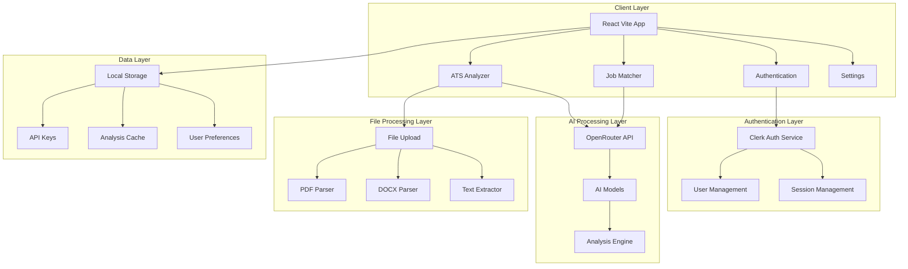

## Component Architecture

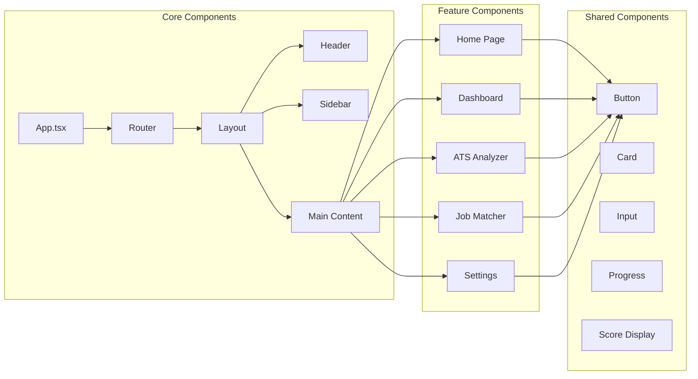

## Authentication Flow

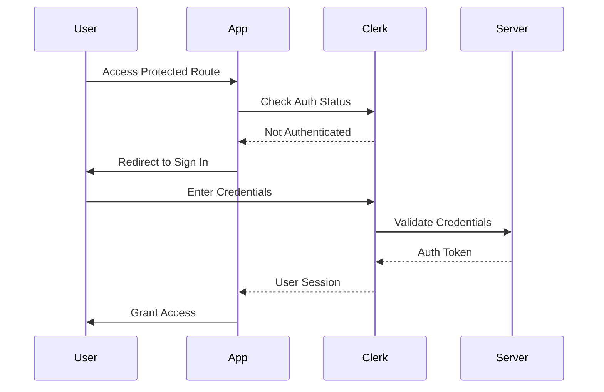

## ATS Analysis Flow

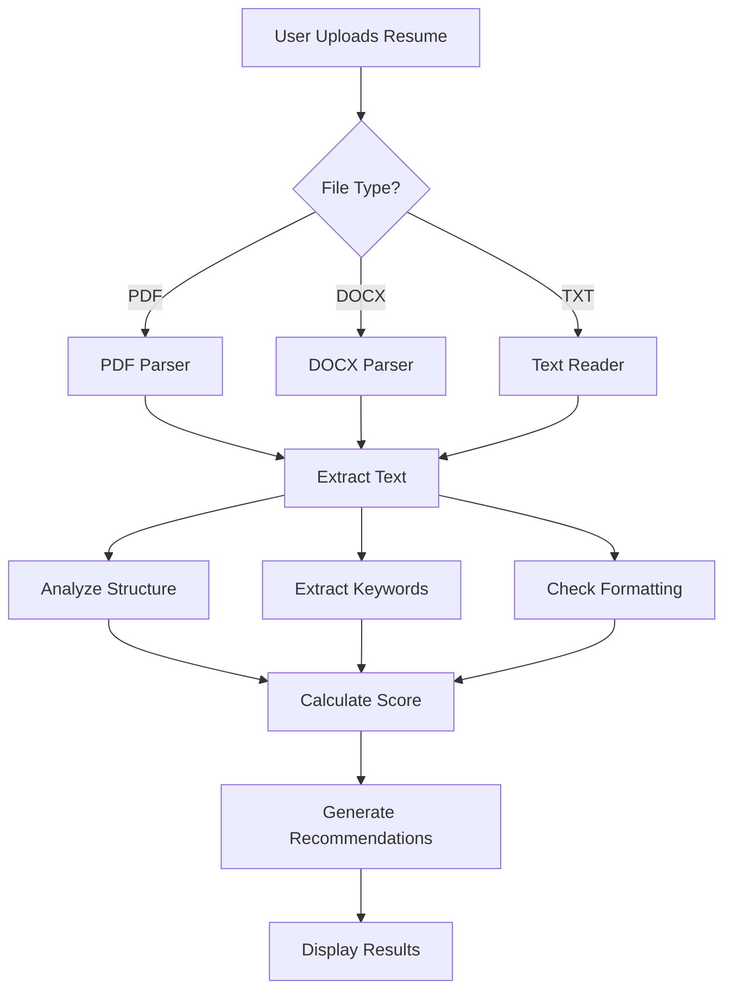

## Job Matching Flow

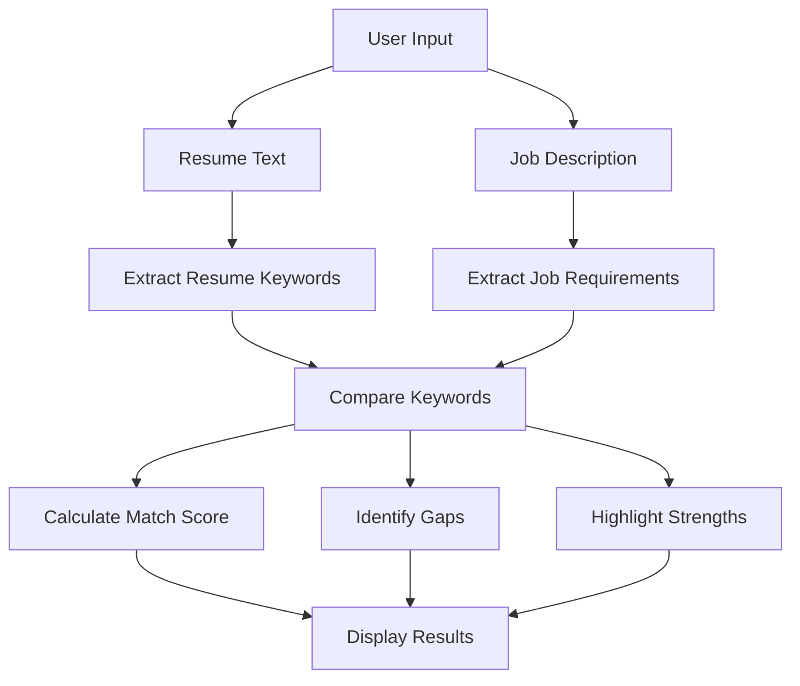

## Data Flow Architecture

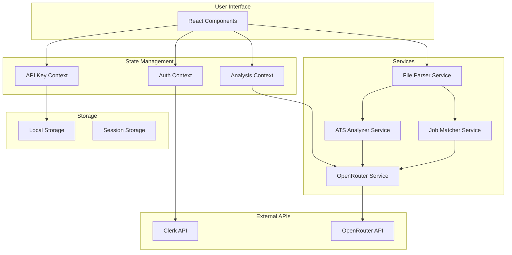

## API Integration Architecture

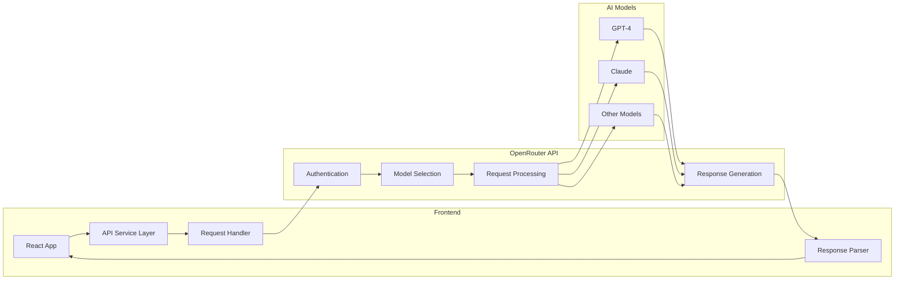

## File Processing Architecture

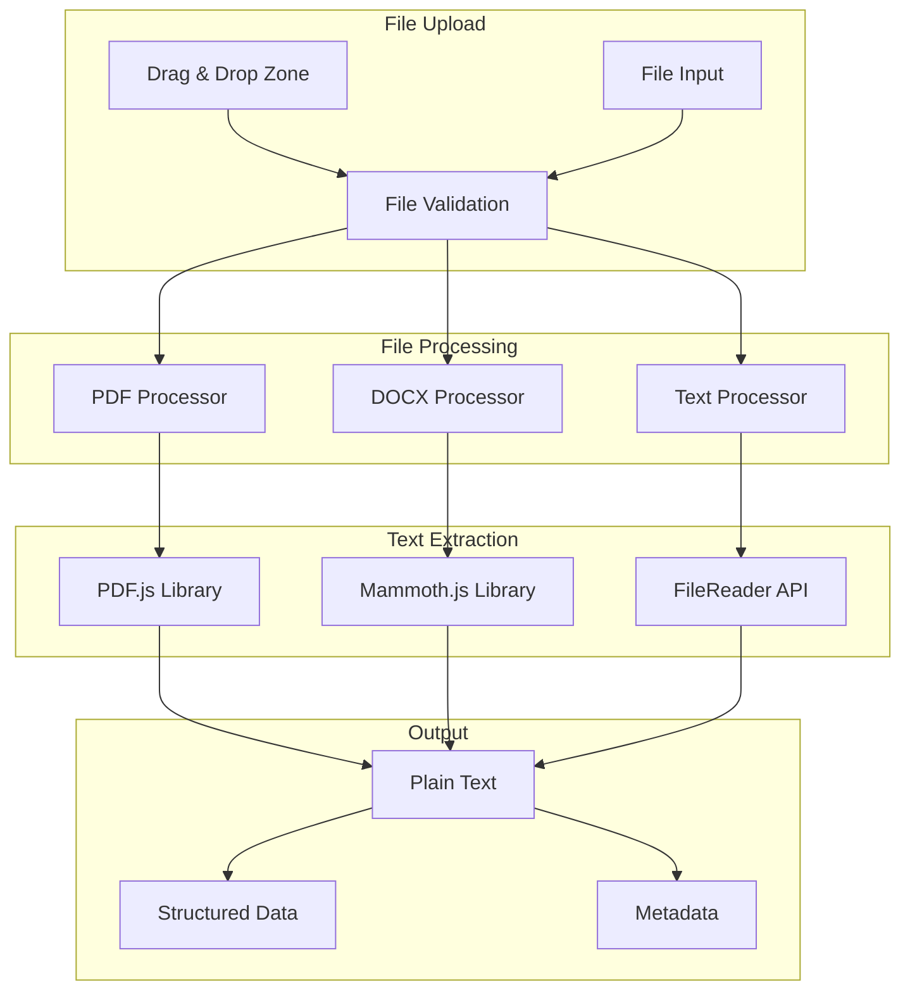

## Scoring Algorithm Architecture

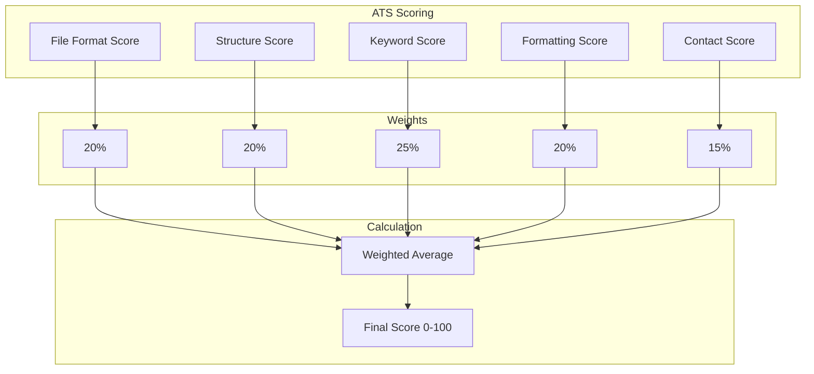

## Job Matching Algorithm

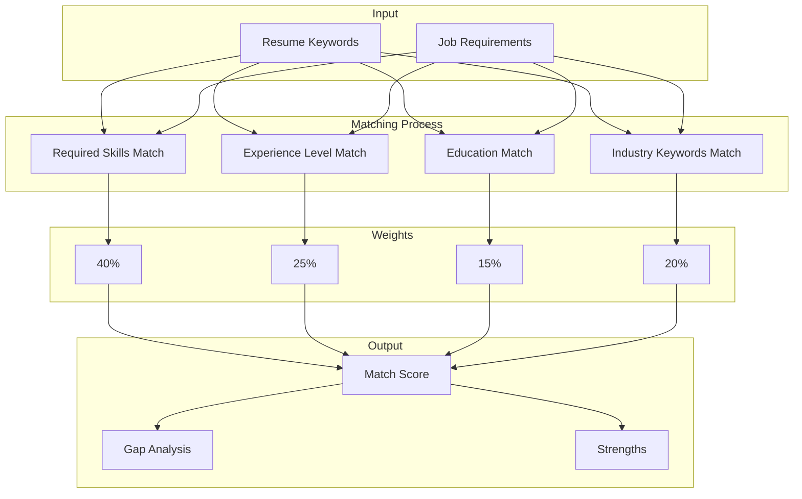

## Responsive Design Breakpoints

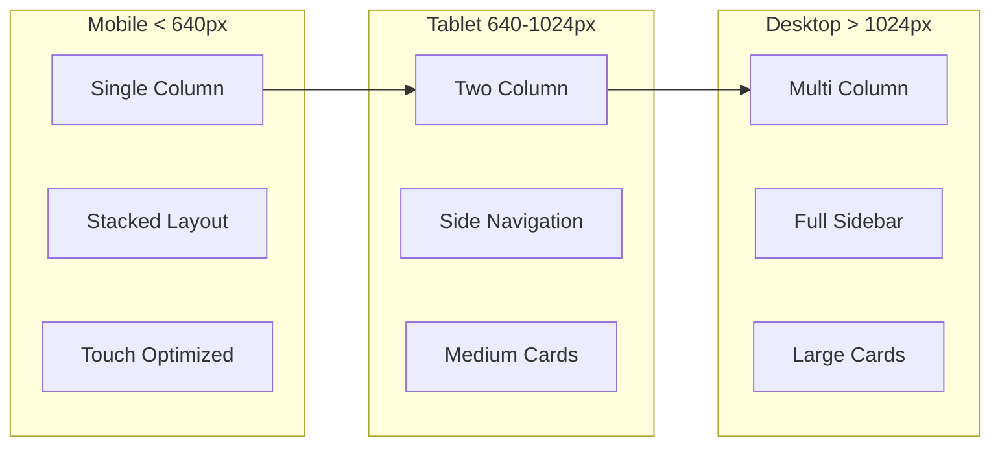

## Error Handling Flow

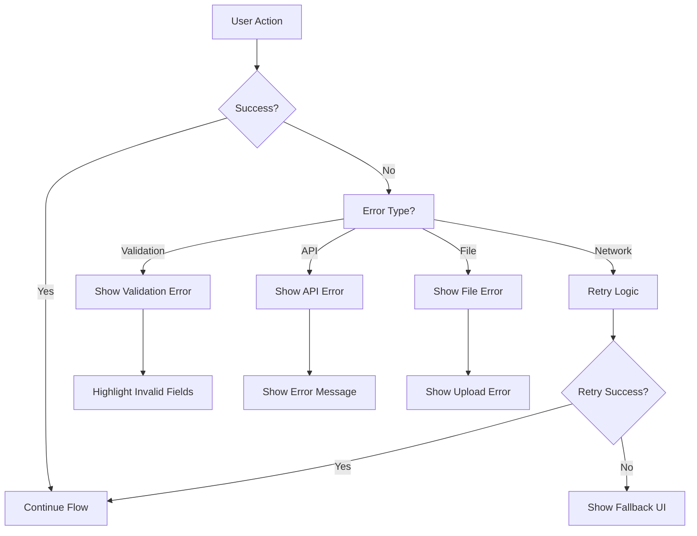

## Performance Optimization Flow

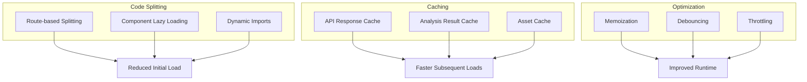

## Security Architecture

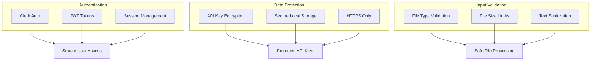

These diagrams provide a comprehensive visual representation of the ResumePilot application architecture, covering all major aspects from system design to security considerations.
